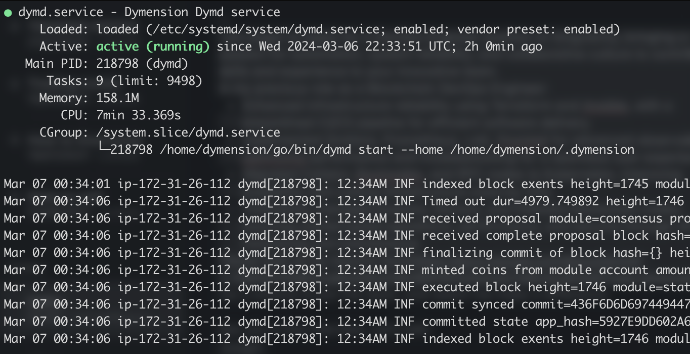

# Ansible Local Dymension
This repository contains an ansible role and playbook set up to deploy a simple local Dymension node on your server of choice.

## How to use
- Create `hosts` file, populate with your server details.
- Run Ansible playbook with the command:
  `ansible-playbook node.yml`
- Confirm `dymd.service` created and running successfully!
  
- `journalctl -u dymd.service` to check logs.

